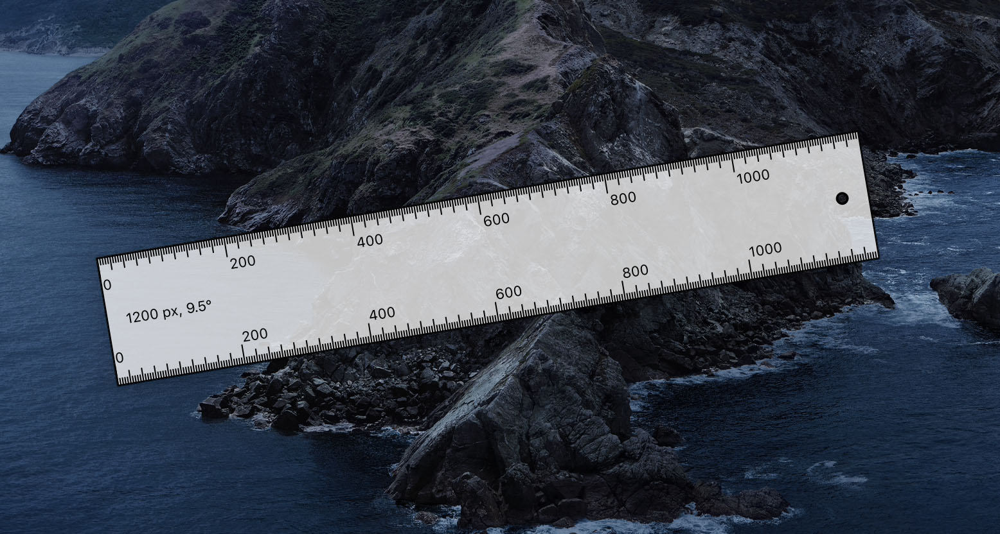

# SomeRuler

A simple pixel ruler for Desktop.

This project was initially inspired by [Ruler](https://archive.codeplex.com/?p=ruler) developed by Jeff Key.
I re-implemented it with Qt, and did some major improvements.

Features & usage:

- Cross platform (tested under Windows 10 and macOS Catalina +)
- High DPI support
- Resizing: drag the circle handle horizontally
- Rotation & angle readings: drag the circle handle upward or downward
- Length readings: click on the tick to read the length
- Reset: double click on the circle handle
- Hiding: press ESC key

